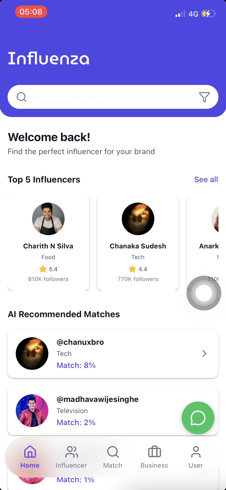
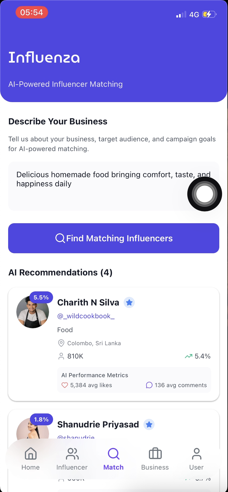
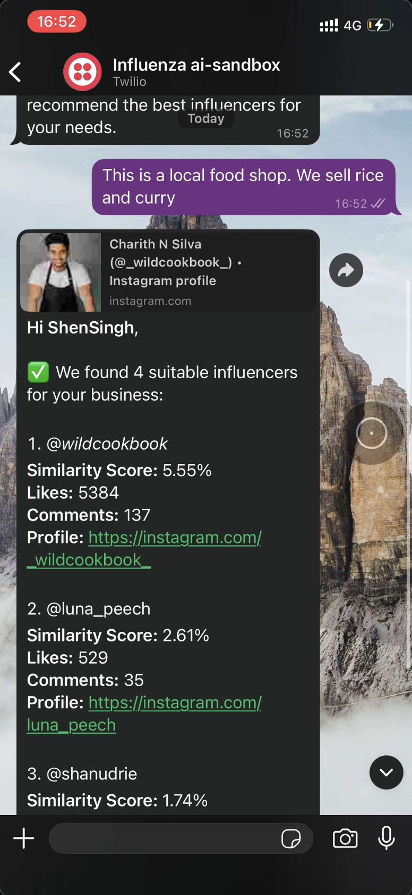
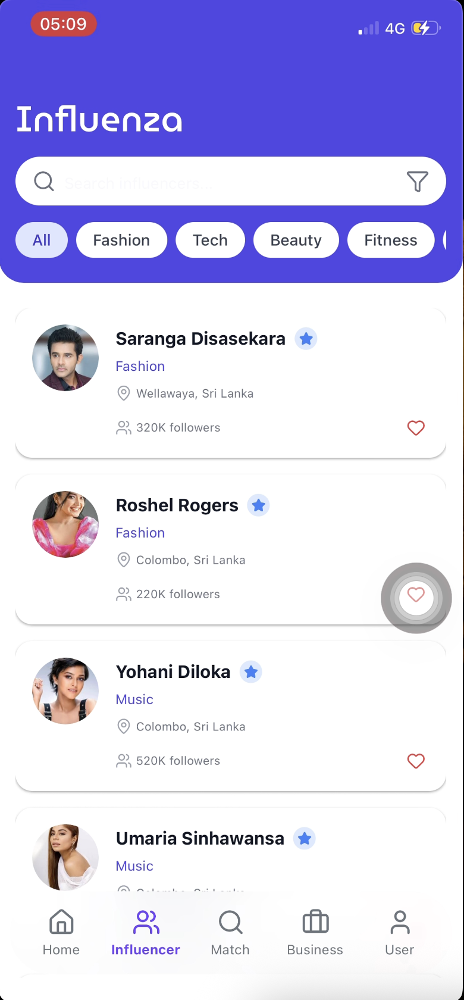
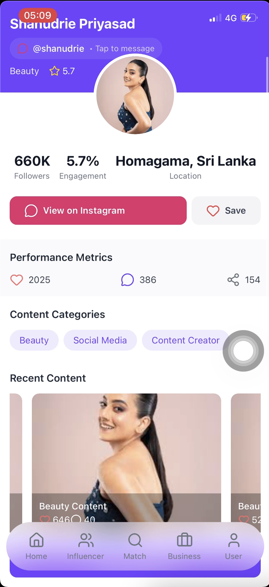

# Influencer Recommendation Platform

This is a comprehensive influencer recommendation platform designed to connect businesses with the most suitable influencers for their campaigns. The project leverages a multi-component architecture, including a mobile application, a robust backend, a machine learning model for recommendations, and a WhatsApp bot for on-the-go access.

## Project Overview

The platform is divided into four main components:

-   **Frontend**: A mobile application built with React Native and Expo, providing a user-friendly interface for businesses to find and connect with influencers.
-   **Backend**: A Node.js and Express-based server that powers the application, handling user authentication, data storage, and API services.
-   **AI-Model**: A Python-based machine learning model that analyzes influencer data and provides intelligent recommendations based on various metrics.
-   **WhatsApp Bot**: An integrated Twilio bot that allows users to interact with the platform and receive influencer recommendations directly through WhatsApp.

## Screenshots

Below are some screenshots of the Influensa mobile application:

| Home Screen | AI Match | WhatsApp Integration |
|-------------|----------|---------------------|
|  |  |  |

| Influencer List | Influencer Details | Welcome Screen |
|-----------------|-------------------|----------------|
|  |  |  |


## Technologies Used

### Frontend

-   **React Native**: For building the cross-platform mobile application.
-   **Expo**: To streamline the development and deployment of the React Native app.
-   **Expo Router**: For file-based routing in the mobile application.
-   **Nativewind**: For styling the user interface with a utility-first approach (Tailwind CSS for React Native).
-   **React Context API**: For global state management (e.g., authentication status).
-   **Axios**: For making HTTP requests to the backend API.

### Backend

-   **Node.js**: As the JavaScript runtime environment.
-   **Express**: As the web application framework for building the RESTful API.
-   **MongoDB**: As the NoSQL database for storing application data.
-   **Mongoose**: As the object data modeling (ODM) library for MongoDB.
-   **JWT (JSON Web Tokens)**: For implementing secure user authentication and authorization.
-   **Nodemailer**: For handling email services, such as password resets.

### AI-Model

-   **Python**: As the primary language for data processing and model development.
-   **FastAPI**: For creating a high-performance API to serve the model's predictions.
-   **Pandas & Scikit-learn**: For data processing, analysis, and building the recommendation model.
-   **Jupyter Notebook**: For model experimentation and development.

### WhatsApp Bot

-   **Twilio**: To integrate WhatsApp messaging capabilities into the platform.
-   **Node.js & Express**: To create the webhook server that handles incoming and outgoing messages.

## Features

### General
- **User Authentication**: Secure sign-up, sign-in, and password reset functionality.
- **Role-based access**: Differentiated experience for regular users and businesses.

### For Businesses
- **Create Business Profile**: Businesses can set up their profile to get relevant influencer matches.
- **AI-Powered Recommendations**: Get a list of top-matching influencers based on the business profile and campaign needs.
- **View Influencer Profiles**: Access detailed profiles of influencers, including their social media metrics.
- **Recent Matches**: Keep track of recently matched influencers.

### For Influencers
- **Profile Management**: Influencers can manage their profiles and social media links.

### Cross-Platform
- **WhatsApp Integration**: Users can interact with the service via a Twilio-powered WhatsApp bot to get recommendations.

## Download APK

You can download the latest APK from the following link:
[Download Influensa APK](https://drive.google.com/file/d/1LFkP-gfT9IrCGhDaoYU7mGXfP9gPhHlh/view?usp=sharing)

## Getting Started

To get the project up and running on your local machine, follow these steps:

### Prerequisites

-   Node.js and npm
-   Python and pip
-   MongoDB instance (local or cloud-based)

### Installation & Setup

1.  **Clone the repository:**
    ```sh
    git clone <repository-url>
    cd influencer-recommendation-platform
    ```

2.  **Backend Setup:**
    ```sh
    cd backend
    npm install
    npm run dev
    ```

3.  **Frontend Setup:**
    ```sh
    cd ../frontend
    npm install
    npm start
    ```

4.  **AI-Model Setup:**
    ```sh
    cd ../Ai-model
    pip install -r requirements.txt
    uvicorn api:app --reload
    ```

5.  **WhatsApp Bot Setup:**
    ```sh
    cd ../inzluenze-whatsapp-ai-bot/server
    npm install
    npm run dev
    ```

Make sure to configure the environment variables in each component's `.env` file to match your local setup (e.g., database connection strings, API keys).
